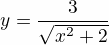

# Table of Contents

1.  [Basic Usage of Org-mode](#org0f5091e)
    1.  [Itemize and Enumeration](#org798ec3c)
    2.  [Quote and examples](#org5448fd6)
    3.  [Export to Markdown](#org46a14f1)

> This is a very messy document. This document is entirely done when I started thinking about writing notes using Emacs org-mode a long time ago. You may want to use some of the templates/styles mentioned here at your own risk! It absolutely comes with no warranty. 

# Basic Usage of Org-mode

This is under the section heading "Basic Usage of Org-mode"

## Itemize and Enumeration

This is under the subsection heading "Itemize and Enumeration"

-   item 1
-   item 2
-   item 3
    
    **bold** *italic* underlined <del>strike-through</del> Greek letter &Gamma;

Some enumerated  items 

1.  First
2.  Second
3.  Third

## Quote and examples

> Everything should be made as simple as possible but not simpler &#x2013; Albert Einstein

    Here is an example
    : Some example from a text file. 

## Export to Markdown

The default *org-mode* does not have the option to export .org file to *markdown* (.md file).   For that you will need to replace the **org** layer in *dotspacemacs* file   with the   following 

    (org :variables
         org-enable-github-support t)

1

**Note: In case C-c C-e command doesn't show the export option for m (markdown), then simply open dotspacemacs file and compile it with M-SPC f e R. After that, you should see the option to export to markdown!** 

