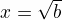

# Table of Contents

1.  [Section Heading](#orga89507a)
    1.  [Subsection heading](#org9ba5f15)
    2.  [Another subsection heading](#org8cbb4fd)
    3.  [Quote and examples](#orgb472247)
    4.  [Export to md](#orgf846b2c)

# Section Heading

## Subsection heading

## Another subsection heading

Some description 

-   item 1
-   item 2
-   item 3
    
    **bold** *italic* underlined <del>strike-through</del> Greek letter &Gamma;

Some enumerated  items 

1.  First
2.  Second
3.  Third

## Quote and examples

> Everything should be made as simple as possible but not simpler &#x2013; Albert Einstein

    Here is an example
    : Some example from a text file. 

## Export to md

The default *org-mode* does not have the option to export .org file to *markdown* (.md file).   For that you will need to replace the **org** layer in *dotspacemacs* file   with the   following 

    (org :variables
         org-enable-github-support t)

**Note: In case C-c C-e command doesn't show the export option for m (markdown), then simply open dotspacemacs file and complile it with M-SPC f e R.** After that, you should see the option to export to markdown! 

